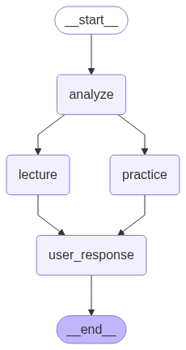
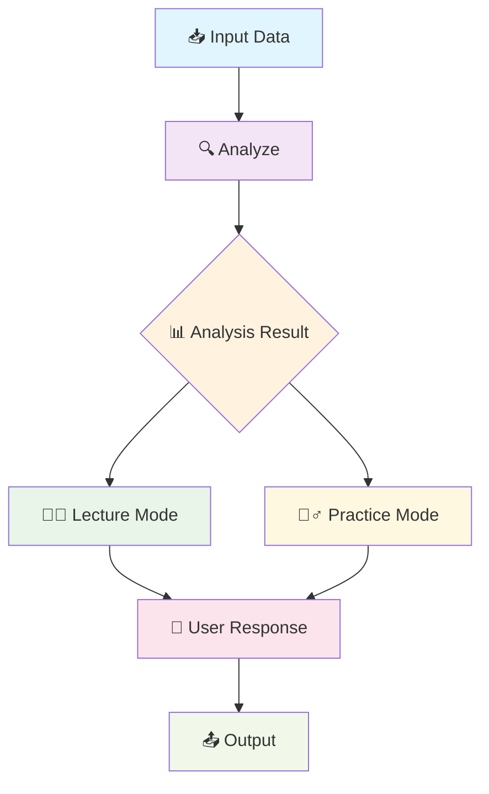

<div align="center">

 &nbsp; 
 &nbsp;


<h1 align="center">
  
</h1>


<h2 align="center">
  
</h2>


[](https://python.org)
[](https://github.com/langchain-ai/langgraph)
[](https://openai.com)
[](LICENSE)
[]()
[]()

<div align="center">
  
</div>


</div>

---

<div align="center">
  
  
  <h2>
    
  </h2>
  
  
</div>

## 🌟 Overview

**EduFlex Agent** is an advanced AI-powered educational assistant that revolutionizes the learning experience through intelligent analysis, personalized lectures, and interactive practice sessions. Built with cutting-edge language models and state-of-the-art graph-based workflows, EduFlex adapts to individual learning styles and provides comprehensive educational support.

<div align="center">


</div>

<div align="center">
  
  
  <h2>
    
  </h2>
  
  
</div>

## 🚀 Key Features

<table>
<tr>
<td width="50%">

### 🔍 **Intelligent Analysis**
- 📊 Analyzes learning data and patterns
- 🎯 Identifies knowledge gaps and strengths
- 📈 Provides personalized learning recommendations

### 👨‍🏫 **AI Lecturer**
- 📚 Delivers comprehensive explanations
- 🎨 Adapts teaching style to learner preferences
- 💡 Provides real-world examples and applications

</td>
<td width="50%">

### 🏋️‍♂️ **Practice Sessions**
- ✍️ Generates targeted exercises
- 🎮 Interactive problem-solving activities
- 📝 Immediate feedback and corrections

### 🔄 **Workflow Integration**
- ⚡ Seamless state management
- 🔗 Graph-based processing pipeline
- 🛠️ Modular and extensible architecture

</td>
</tr>
</table>

<div align="center">


<h2>
  
</h2>


</div>

## 🏗️ Architecture & Workflow

<div align="center">

### 📊 **System Workflow**



</div>

The EduFlex Agent follows a sophisticated multi-stage workflow:



<div align="center">


<h2>
  
</h2>
</div>

## ⚡ Quick Start


### 🔧 Installation

1. **Clone the repository**
   ```bash
   git clone https://github.com/shynnemi/eduflex-agent.git
   cd eduflex-agent
   ```

2. **Install dependencies**
   ```bash
   pip install -r requirements.txt
   # or using uv
   uv sync
   ```

3. **Set up environment variables**
   ```bash
   # Create a .env file
   echo "GEMINI_API_KEY=your_gemini_api_key_here" > .env
   ```

### 🚀 Usage

```python
from agent.agent import Agent

# Initialize the agent
agent = Agent(gemini_api_key=None)  # Uses .env file

# Load your learning data
with open('your_data.txt', 'r', encoding='utf-8') as file:
    learning_data = file.read()

# Run the agent
result = agent.graph.invoke({
    "messages": learning_data,
})

print(result["user_response"])
```

<div align="center">

</div>

## 📁 Project Structure

```
eduflex_agent/
├── 📁 agent/
│   ├── 🤖 agent.py          # Main agent implementation
│   ├── ⚙️ config.py         # Configuration settings
│   ├── 💬 prompts.py        # AI prompts and templates
│   ├── 📋 schema.py         # Data schemas and models
│   ├── 🔄 states.py         # State management
│   └── 🛠️ utils.py          # Utility functions
├── 📊 eduflex_workflow.png   # Workflow visualization
├── 📝 example.py            # Usage example
├── 📄 mock_data.txt         # Sample data
├── ⚙️ pyproject.toml        # Project configuration
└── 📖 README.md             # This file
```

## 🔧 Configuration

The agent uses a modular configuration system:

- **🤖 Model Configuration**: Supports various LLM providers
- **📊 State Management**: Robust state handling with LangGraph
- **🔌 API Integration**: Seamless integration with Gemini API
- **🎯 Prompt Engineering**: Optimized prompts for educational tasks

## 🎯 Use Cases


### 🎓 **For Students**
- Personalized tutoring sessions
- Homework assistance and explanation
- Concept clarification and reinforcement
- Practice problem generation

### 👨‍🏫 **For Educators**
- Curriculum development support
- Student progress analysis
- Adaptive learning path creation
- Assessment generation

### 🏢 **For Organizations**
- Employee training programs
- Skill gap analysis
- Corporate learning initiatives
- Knowledge base enhancement

## 🤝 Contributing

<div align="center">

</div>

We welcome contributions! Please feel free to submit a Pull Request. For major changes, please open an issue first to discuss what you would like to change.

1. Fork the Project
2. Create your Feature Branch (`git checkout -b feature/AmazingFeature`)
3. Commit your Changes (`git commit -m 'Add some AmazingFeature'`)
4. Push to the Branch (`git push origin feature/AmazingFeature`)
5. Open a Pull Request

## 📧 Contact

<div align="center">


<h1 align="center">
  
</h1>


[](mailto:nguyentrongphuocbh.ai@gmail.com)
[](https://github.com/shynnemi)


</div>

## 📄 License

This project is licensed under the MIT License - see the [LICENSE](LICENSE) file for details.

## 🙏 Acknowledgments

- **LangGraph** for the powerful graph-based framework
- **OpenAI** for the advanced language models
- **Google Gemini** for AI capabilities
- The open-source community for inspiration and support

---

<div align="center">


<h3>
  
</h3>


</div>